# Application Flow Document

## Overview

This document outlines the flow of the Samudra Paket ERP system, detailing the user journeys, business processes, and interactions between different modules. It serves as a guide for developers to understand how the application should function from a user perspective.

## Core User Flows

### 1. Authentication Flow

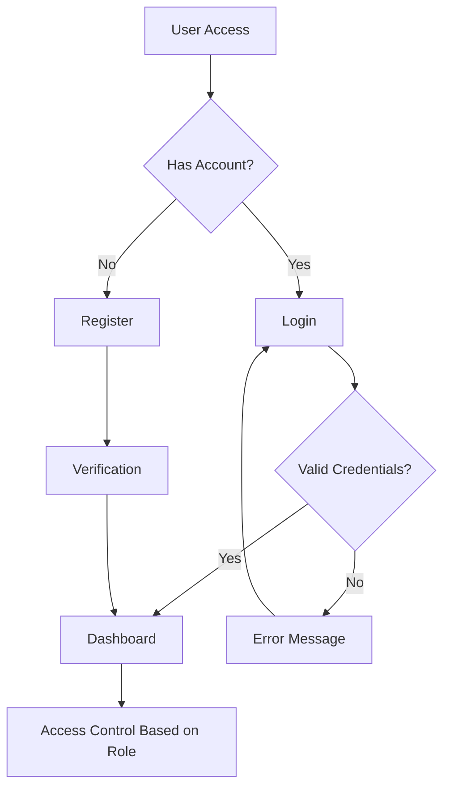

#### Process Description:
1. User accesses the system via web or mobile application
2. If the user has an account, they proceed to login; otherwise, they register
3. After successful authentication, users are directed to their role-specific dashboard
4. Access to features is controlled based on user role and permissions

### 2. Pickup Management Flow

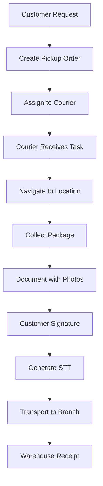

#### Process Description:
1. Customer requests pickup via call center or app
2. Admin creates pickup order in the system
3. System assigns pickup to available courier
4. Courier receives notification and task details
5. Courier navigates to pickup location using app
6. Package is collected and documented with photos
7. Customer provides digital signature
8. System generates Surat Tanda Terima (STT)
9. Package is transported to branch
10. Warehouse staff receives and processes the package

### 3. Shipment Processing Flow

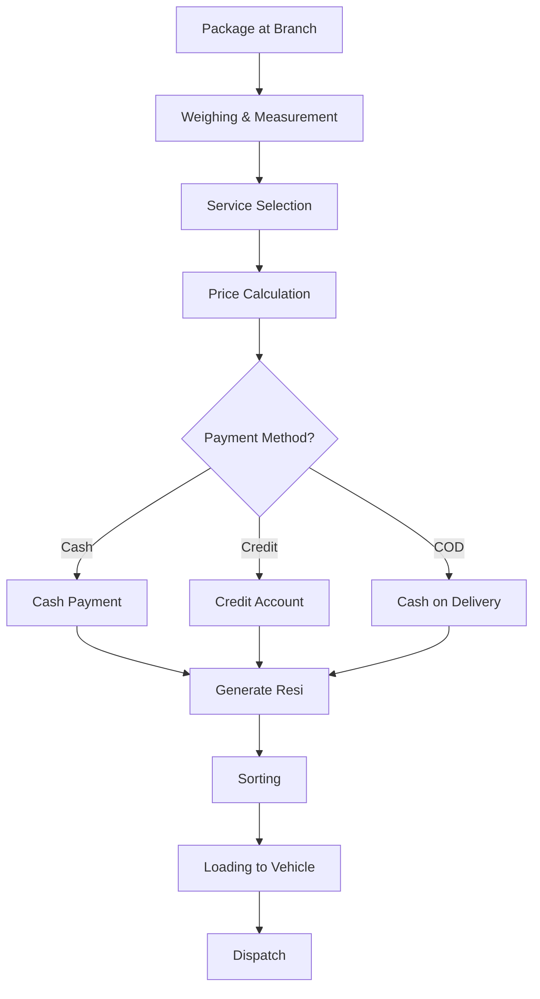

#### Process Description:
1. Package arrives at branch and is processed
2. Staff weighs and measures the package
3. Service type is selected based on customer needs
4. System calculates shipping cost
5. Payment is processed (cash, credit, or COD)
6. System generates shipping receipt (resi)
7. Package is sorted based on destination
8. Package is loaded to appropriate vehicle
9. Vehicle is dispatched for delivery

### 4. Delivery Management Flow

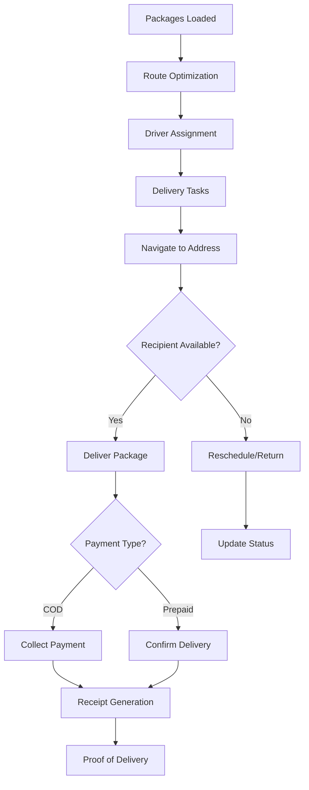

#### Process Description:
1. Packages are loaded onto delivery vehicles
2. System optimizes delivery routes
3. Drivers are assigned delivery tasks
4. Driver navigates to delivery address
5. If recipient is available, package is delivered
6. For COD shipments, payment is collected
7. Delivery is confirmed with digital signature
8. System generates proof of delivery
9. If recipient is unavailable, delivery is rescheduled or package is returned

### 5. Financial Management Flow

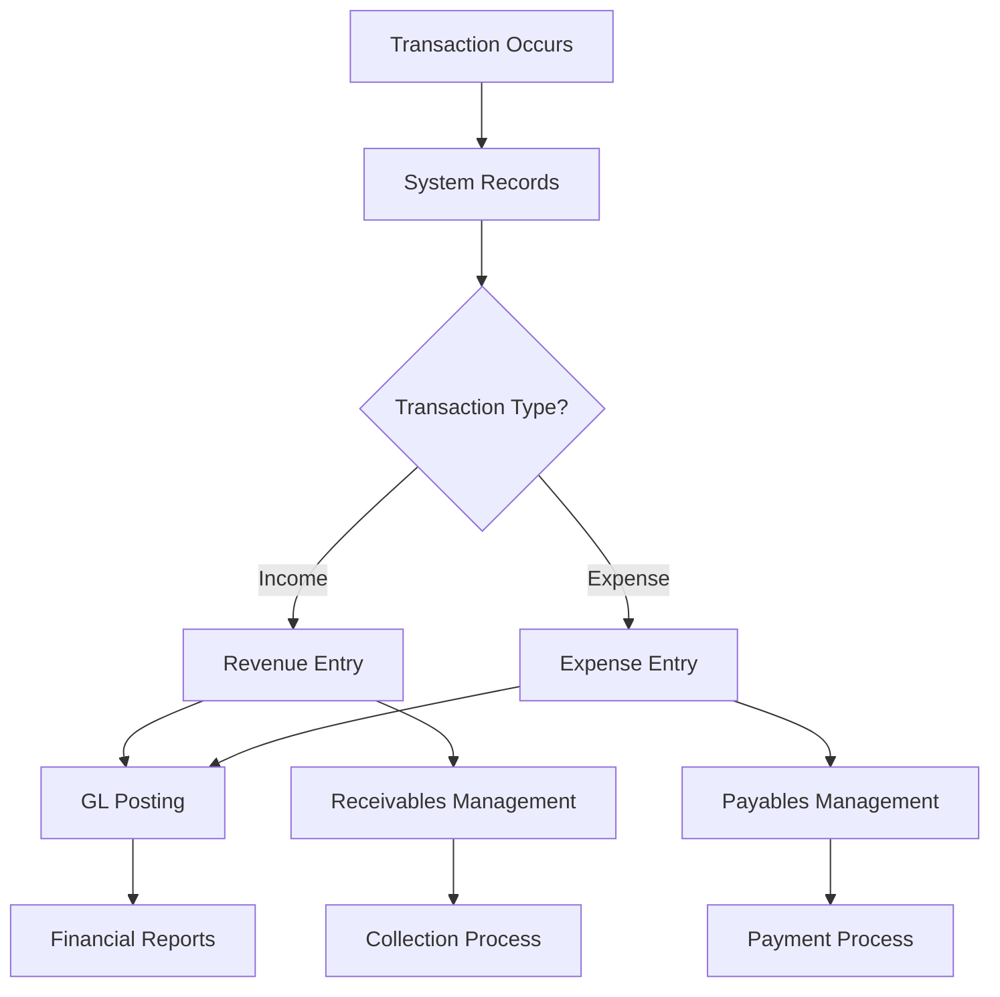

#### Process Description:
1. Financial transaction occurs (shipping payment, COD collection, expense)
2. System records transaction details
3. Transaction is categorized as income or expense
4. Entry is posted to general ledger
5. Financial reports are updated
6. Receivables and payables are managed
7. Collection and payment processes are initiated as needed

### 6. Return Management Flow

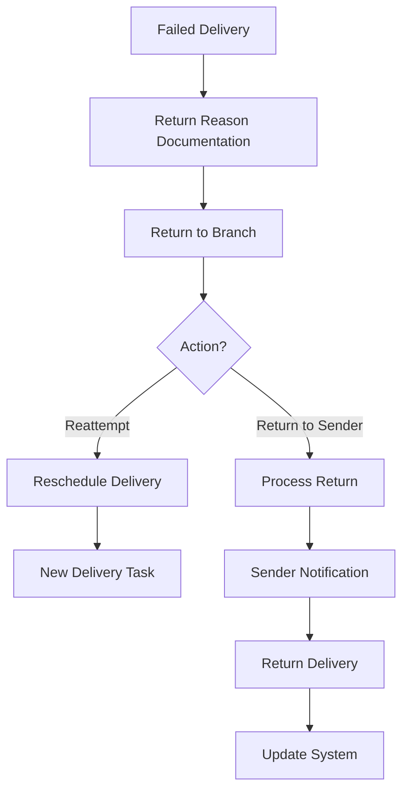

#### Process Description:
1. Delivery attempt fails
2. Driver documents reason for failed delivery
3. Package is returned to branch
4. Decision is made to reattempt delivery or return to sender
5. For reattempt, new delivery task is created
6. For return to sender, return process is initiated
7. Sender is notified of the return
8. Package is delivered back to sender
9. System is updated with final status

## Module Interactions

### Web Application Modules

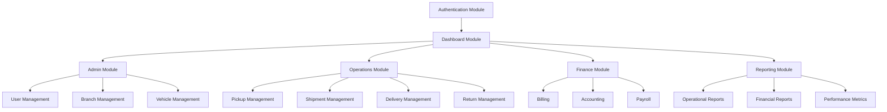

### Mobile Application Modules

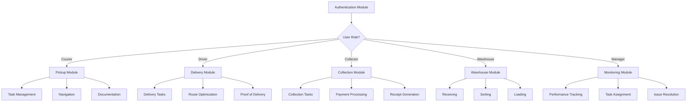

## Data Flow

### High-Level Data Flow

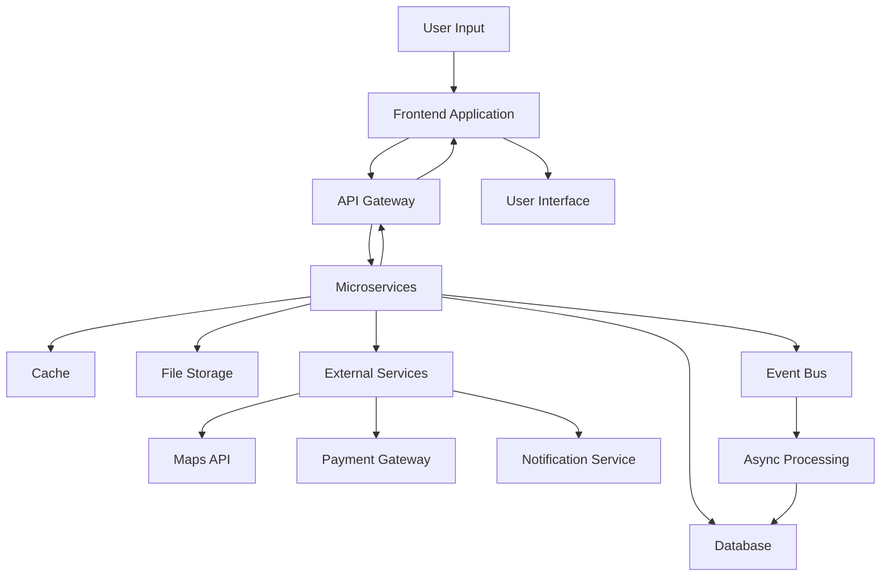

## State Transitions

### Shipment Status Transitions

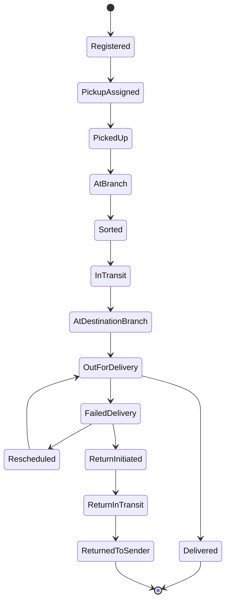

### Payment Status Transitions

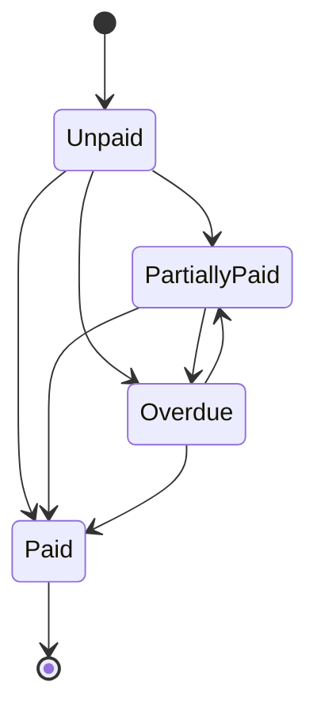

## Integration Points

### External System Integrations

1. **Maps and Routing Services**
   - Route optimization for pickups and deliveries
   - Geocoding for address validation
   - Real-time tracking of vehicles

2. **Payment Gateway**
   - Processing electronic payments
   - Handling refunds
   - Transaction verification

3. **Notification Services**
   - SMS notifications to customers
   - Email notifications for status updates
   - WhatsApp integration for customer communication

4. **Banking Systems**
   - Reconciliation of payments
   - Automated bank transfers
   - Financial reporting

## Error Handling and Recovery

### Common Error Scenarios

1. **Network Connectivity Issues**
   - Mobile app operates in offline mode
   - Data is queued for synchronization
   - Critical operations are prioritized when connectivity returns

2. **Payment Processing Failures**
   - Retry mechanism with exponential backoff
   - Alternative payment method suggestions
   - Manual intervention process

3. **Address Validation Failures**
   - Fallback to manual verification
   - Customer contact process
   - Address correction workflow

4. **Device Failures**
   - Session recovery mechanisms
   - Data backup and restoration
   - Alternative device procedures

## Conclusion

This application flow document provides a comprehensive overview of the Samudra Paket ERP system's operational flows. It serves as a guide for development teams to understand the expected behavior and interactions within the system. As the project evolves, this document should be updated to reflect any changes in business processes or technical implementations.